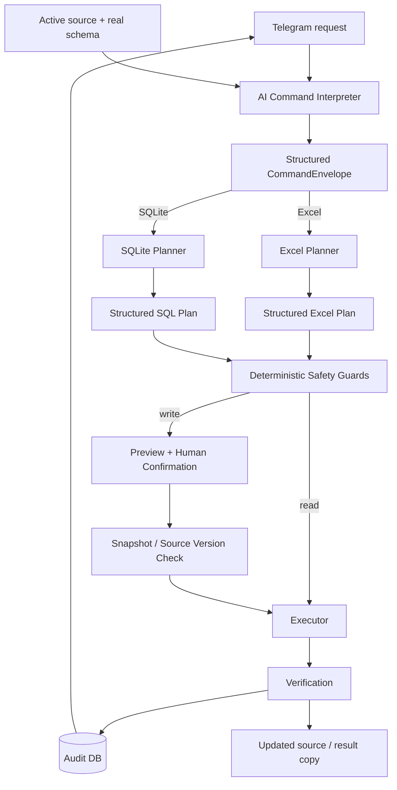

<div align="center">

# 📊 DataOps Commander

### AI agent for safe natural-language operations on Excel and SQLite


**Natural language → structured plan → human approval → verified data change**

</div>

**DataOps Commander** is a Telegram-controlled AI data operations agent. It understands free-form requests, inspects the real schema of the selected Excel workbook or SQLite database, builds a structured plan, shows a preview, and performs write operations only after explicit human confirmation.

The project is designed around one boundary:

> **The LLM understands intent. Deterministic code owns execution and safety.**

The model does not receive arbitrary filesystem access and never executes raw SQL.

---

## Why this project exists

Many operational data tasks are simple but repetitive:

- clean an Excel export
- remove invalid rows
- rename columns
- update values by condition
- deduplicate records
- inspect a SQLite database
- repeat the same cleanup on another file

DataOps Commander turns those requests into controlled, auditable operations without requiring the operator to manually edit every spreadsheet or write SQL.

### Example

```text
Rename client to client_name, remove rows with empty email,
deduplicate by email, and save the result as clean_clients.xlsx.
```

The agent turns that single message into an ordered multi-step plan, previews it, waits for approval, creates a snapshot, executes the steps sequentially, verifies the result, and records the operation in the audit log.

---

## Core Capabilities

### AI-native command understanding

The command interpreter is responsible for semantics rather than Python keyword matching.

It handles:

- free-form Russian / English requests
- slang, typos and synonyms
- active-file context
- schema-aware column matching
- file references inside compound commands
- up to **12 ordered tasks in one message**
- operational commands such as undo, repeat, copy, rename and send-result

The runtime receives structured Pydantic models instead of executing arbitrary model text.

### Excel operations

Supported write/read actions include:

- select / inspect rows
- update values by filter
- replace all filled cells
- delete rows
- add a column
- rename a column
- drop a column
- clear values
- deduplicate records

### SQLite operations

Supported actions:

- `SELECT`
- filtered `UPDATE`
- filtered `DELETE`

The LLM produces a structured SQL operation plan — **not raw SQL**.

### Operational workflow

- persistent Telegram file dashboard
- local and Telegram-uploaded data sources
- active source context
- preview before writes
- explicit confirmation
- optional copy instead of editing the original
- custom output filename
- snapshot before changes
- undo / restore from snapshot
- repeat the last operation on another source
- send the latest processed file
- audit history and per-operation details
- dependency health check

---

## Architecture



A deeper breakdown is available in [`docs/ARCHITECTURE.md`](docs/ARCHITECTURE.md).

---

## Safety Model

DataOps Commander treats LLM output as a proposal, not execution authority.

### Filesystem boundaries

- only one configured workspace root is trusted
- Telegram callback payloads use short source IDs instead of arbitrary paths
- source files are resolved through the catalog
- writes are locked per file

### Human confirmation

Read-only operations can run immediately.

Write operations require:

```text
AI plan
→ preview
→ explicit confirmation
→ snapshot
→ execution
→ verification
```

If the source changes between preview and confirmation, the operation is rejected.

### Excel protection

- atomic replacement after validating a temporary copy
- write limits for large operations
- merged-cell guards
- workbook structure inspection
- risky workbooks with formulas / complex structures can be blocked from writes
- post-write verification

### SQLite protection

- no raw SQL from the LLM
- parameterized execution
- `UPDATE` / `DELETE` require filters
- destructive schema operations are unsupported
- transactional writes and rollback
- database integrity checks

### Undo

Before a write, DataOps stores a snapshot.

Undo is allowed only when the current file still matches the version produced by the target operation. This prevents an old rollback from silently destroying newer external changes.

See [`docs/SAFETY.md`](docs/SAFETY.md).

---

## Multi-step Planning

A single Telegram message can contain up to 12 independent tasks.

For example:

```text
In price.xlsx rename Товар to Название,
set stock to 77 for Периферия,
then remove duplicates by Артикул.
```

DataOps plans the tasks in order against a staging copy:

```text
Step 1 result
   ↓
becomes Step 2 input
   ↓
becomes Step 3 input
   ↓
one final verified write
```

This matters because later tasks see the schema and data produced by earlier steps.

---

## Telegram Control Plane

The bot provides a persistent file dashboard with:

- local workspace files
- separately stored Telegram uploads
- source refresh
- active source selection
- schema inspection
- operation preview
- confirmation / cancellation
- history
- health status
- audit details
- download of the latest processed file
- undo

The selected source becomes the default context for subsequent natural-language requests.

---

## Supported Sources

| Source | Discovery | Read | Write |
|---|---:|---:|---:|
| Excel `.xlsx` | ✅ | ✅ | ✅ |
| SQLite `.db/.sqlite/.sqlite3` | ✅ | ✅ | ✅ |
| CSV / TSV | ✅ | Roadmap | Roadmap |
| JSON / text / `.sql` files | ✅ | Catalog only | — |
| Google Sheets | Roadmap | Roadmap | Roadmap |

The public `v1.0.0` portfolio release focuses on Excel and SQLite.

---

## Local AI Stack

| Role | Default |
|---|---|
| Command interpretation | `qwen3:8b` |
| Excel planning | `qwen3:8b` |
| SQLite planning | `qwen3:8b` |
| Inference runtime | Ollama |

The model is asked for structured JSON matching Pydantic schemas and runs with deterministic planning settings.

---

## Quick Start

### 1. Install Ollama and pull the model

```bash
ollama pull qwen3:8b
```

### 2. Create a virtual environment

Windows PowerShell:

```powershell
python -m venv .venv
.venv\Scripts\Activate.ps1
python -m pip install -r requirements.txt
```

### 3. Configure the application

```powershell
Copy-Item .env.example .env
```

Fill in:

```env
TELEGRAM_BOT_TOKEN=your_bot_token
ALLOWED_TELEGRAM_USER_IDS=your_telegram_user_id
```

### 4. Create a safe demo workspace

```powershell
python .\scripts\create_demo_workspace.py
```

This generates demo Excel / SQLite sources inside the local `workspace_files` directory.

### 5. Run the regression suite

```powershell
python -m unittest discover -s tests -v
```

### 6. Start DataOps Commander

```powershell
python -m app.main
```

---

## Demo Commands

After selecting `price.xlsx`:

```text
show products where stock is below 5

set stock to 99 for products in category Периферия

rename column Товар to Название

remove the column with prices from the price table

rename Товар to Название, set Периферия stock to 77,
then remove duplicates by Артикул
```

For `warehouse.sqlite3`:

```text
show products with stock below 5

set stock to 77 for category Периферия

delete products where stock equals zero
```

Operational requests are also AI-interpreted:

```text
make a copy instead of changing the original

name the result clean_price.xlsx

send me the last processed file

repeat the last operation on another file

undo the last change
```

---

## Testing

The public repository contains **34 automated regression tests**.

They cover:

- AI-native command interpretation
- compound multi-task commands
- Excel batch dependency chaining
- SQLite batch dependency chaining
- Excel reads and writes
- SQL transaction behavior
- filtered-delete safety
- source-change protection
- workbook structure discovery
- merged-cell guards
- dashboard navigation
- source catalog behavior
- result naming / copy options
- audit database lifecycle
- snapshot restore / undo safety

Run:

```powershell
python -m unittest discover -s tests -v
```

See [`docs/TESTING.md`](docs/TESTING.md).

---

## Project Structure

```text
dataops-commander/
├── app/
│   ├── main.py              # Telegram orchestration / UI
│   ├── intent.py            # AI-native command interpreter
│   ├── source_catalog.py    # Safe source discovery
│   ├── excel_service.py     # Workbook schema inspection
│   ├── excel_planner.py     # Structured AI Excel plans
│   ├── excel_operations.py  # Excel preview / execution / verification
│   ├── sql_service.py       # SQLite schema inspection
│   ├── sql_planner.py       # Structured AI SQL plans
│   ├── sql_operations.py    # Transactional SQLite execution
│   ├── batch_operations.py  # Ordered multi-step execution
│   ├── rollback.py          # Snapshot restore / undo
│   ├── database.py          # Audit and operation state
│   └── micro_features.py    # Output / copy execution options
├── demo_data/
├── scripts/
├── docs/
├── tests/
├── .env.example
└── requirements.txt
```

---

## Engineering Focus

This project explores a practical AI-agent boundary:

**How do you let an LLM understand an imprecise human request while preventing it from becoming an unrestricted data-execution engine?**

The implementation separates:

```text
semantic understanding
        ↓
structured planning
        ↓
deterministic validation
        ↓
human approval
        ↓
controlled execution
```

The most important engineering work is around schema grounding, write safety, stale-preview protection, snapshots, transactional execution, verification and regression testing — not just prompt generation.

---

## Limitations

The portfolio release intentionally has a narrow execution surface.

- Excel workbooks with formulas may be blocked for write operations
- structural writes can be blocked for complex workbooks with charts / images / tables
- SQLite databases with triggers, foreign-key complexity or `WITHOUT ROWID` can be restricted to safe reads
- PostgreSQL is not implemented
- Google Sheets is not implemented
- CSV / TSV execution adapters are not implemented
- the primary user interface is Telegram

These boundaries are deliberate safety constraints, not hidden capabilities.

---

## Version

**DataOps Commander v1.0.0 — Portfolio Release**

The current release is the stable portfolio baseline for Excel + SQLite data operations.

See [`CHANGELOG.md`](CHANGELOG.md).

---

## Security

Never commit a real `.env`, Telegram token, local audit database, workspace files, snapshots, result files or customer data.

See [`SECURITY.md`](SECURITY.md).

---

## Author

Built by **0xkentoshi** as part of an AI automation portfolio.

Open to opportunities in **AI automation, AI agents, Python automation and workflow automation**.
